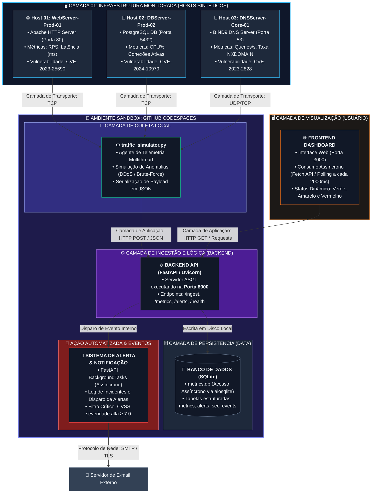

# Plataforma de Monitoramento DevOps — Documentação Técnica

## Sumário

1. [Arquitetura do Sistema](#1-arquitetura-do-sistema)
2. [Guia de Instalação — Runbook de Setup](#2-guia-de-instalação--runbook-de-setup)
3. [Manual de Operação — Runbook do Operador](#3-manual-de-operação--runbook-do-operador)
4. [Playbooks de Incidentes](#4-playbooks-de-incidentes)
5. [Considerações de Segurança](#5-considerações-de-segurança)

---

## 1. Arquitetura do Sistema

### 1.1 Visão Geral

A plataforma é composta por quatro camadas funcionais que se comunicam via protocolo HTTP seguindo o padrão **REST (Representational State Transfer)**. Cada camada possui responsabilidade única e fronteiras bem definidas.

```
┌─────────────────────────────────────────────────────────────────┐
│                        USUÁRIO / OPERADOR                        │
└───────────────────────────────┬─────────────────────────────────┘
                                │ HTTP (Browser)
                                ▼
┌─────────────────────────────────────────────────────────────────┐
│              FRONT-END  ·  localhost:3000                        │
│         Python HTTP Server · HTML/CSS/JS estático               │
│  Dashboard responsivo · Polling REST · Renderização de métricas │
└───────────────────────────────┬─────────────────────────────────┘
                                │ REST API (JSON)
                                │ GET /metrics  |  GET /alerts
                                ▼
┌─────────────────────────────────────────────────────────────────┐
│              BACK-END   ·  localhost:8000                        │
│          FastAPI + Uvicorn · Python 3.x · Async I/O             │
│   Ingestão de métricas · Validação · Lógica de negócio          │
│   Geração de alertas · Endpoints RESTful documentados (OpenAPI) │
└───────────────────────────────┬─────────────────────────────────┘
                                │ SQL (sqlite3)
                                ▼
┌─────────────────────────────────────────────────────────────────┐
│              BANCO DE DADOS  ·  ./metrics.db                     │
│                   SQLite 3 · Arquivo local                       │
│       Tabelas: metrics · alerts · security_events               │
└─────────────────────────────────────────────────────────────────┘
                                ▲
                                │ POST /ingest  (HTTP)
┌─────────────────────────────────────────────────────────────────┐
│          SIMULADOR DE TRÁFEGO  ·  traffic_simulator.py          │
│   Gera carga sintética · Publica métricas via REST no Backend   │
│   Simula picos, falhas HTTP 5xx, anomalias de latência e CVEs   │
└─────────────────────────────────────────────────────────────────┘

## 🏗️ Arquitetura Detalhada do Sistema

O ecossistema da plataforma foi desenhado seguindo uma abordagem modular e orientada a eventos. O diagrama abaixo ilustra o fluxo completo do dado, desde o monitoramento dos ativos de rede (Hosts Sintéticos) até a ingestão, persistência e visualização das métricas.



### 1.2 Componentes e Responsabilidades

| Componente | Tecnologia | Porta | Responsabilidade |
|---|---|---|---|
| Front-end | Python HTTP Server / HTML+JS | 3000 | Exibição do dashboard; consulta REST periódica ao Backend |
| Back-end | FastAPI + Uvicorn | 8000 | API RESTful; ingestão, validação e persistência de métricas |
| Banco de Dados | SQLite 3 | — (arquivo local) | Armazenamento persistente de métricas e eventos de segurança |
| Simulador de Tráfego | Python Script | — | Geração de carga sintética e dados de teste via HTTP POST |

### 1.3 Fluxo de Dados (Request Lifecycle)

```
Simulador → POST /ingest → Backend (valida + persiste) → SQLite
Frontend  → GET /metrics  → Backend (consulta SQLite)  → JSON → Render Dashboard
```

- O Frontend realiza **polling** a cada `N` segundos para os endpoints `/metrics` e `/alerts`.
- O Backend expõe documentação automática via **OpenAPI** em `http://localhost:8000/docs`.
- Toda comunicação entre camadas usa **JSON** como formato de serialização.

### 1.4 Padrões REST Adotados

| Princípio REST | Implementação |
|---|---|
| Stateless | Cada request ao Backend carrega toda informação necessária; sem sessão no servidor |
| Interface Uniforme | Verbos HTTP semânticos: `GET` (leitura), `POST` (ingestão), `DELETE` (limpeza) |
| Recursos nomeados | URIs descritivos: `/metrics`, `/alerts`, `/health`, `/ingest` |
| Representação JSON | Respostas padronizadas com `Content-Type: application/json` |
| Código de Status HTTP | 200 OK, 201 Created, 400 Bad Request, 422 Unprocessable Entity, 500 Internal Error |

---

## 2. Guia de Instalação — Runbook de Setup

### 2.1 Pré-requisitos

Antes de iniciar, certifique-se de que o ambiente atende aos seguintes requisitos:

- [ ] **Sistema Operacional:** Linux (Ubuntu 20.04+) ou GitHub Codespaces
- [ ] **Python:** versão 3.8 ou superior
- [ ] **pip:** gerenciador de pacotes Python atualizado
- [ ] **Git:** para clonar o repositório
- [ ] **Portas disponíveis:** 3000 (Frontend) e 8000 (Backend)

Verificação rápida do ambiente:

```bash
python3 --version     # Esperado: Python 3.8+
pip --version         # Esperado: pip 21+
git --version
lsof -i :3000         # Deve retornar vazio (porta livre)
lsof -i :8000         # Deve retornar vazio (porta livre)
```

### 2.2 Instalação

#### Passo 1 — Clonar o Repositório

```bash
git clone https://github.com/seu-usuario/devops-monitoring-platform.git
cd devops-monitoring-platform
```

#### Passo 2 — Criar e Ativar Ambiente Virtual (recomendado)

```bash
python3 -m venv .venv
source .venv/bin/activate
```

#### Passo 3 — Instalar Dependências do Backend

```bash
pip install --upgrade pip
pip install -r backend/requirements.txt
```

Dependências típicas do `requirements.txt`:

```
fastapi>=0.100.0
uvicorn[standard]>=0.23.0
pydantic>=2.0.0
aiosqlite>=0.19.0
httpx>=0.25.0
python-dotenv>=1.0.0
```

#### Passo 4 — Configurar Variáveis de Ambiente

```bash
cp backend/.env.example backend/.env
```

Edite o arquivo `backend/.env` com as credenciais necessárias:

```dotenv
# Configurações de SMTP para notificações de alertas
SMTP_HOST=smtp.seu-provedor.com
SMTP_PORT=587
SMTP_USER=alertas@sua-empresa.com
SMTP_PASSWORD=sua_senha_segura

# Configurações do banco de dados
DB_PATH=./metrics.db

# Nível de log (DEBUG | INFO | WARNING | ERROR)
LOG_LEVEL=INFO
```

> ⚠️ **NUNCA** versione o arquivo `.env`. Certifique-se de que ele está listado no `.gitignore`.

### 2.3 Inicialização dos Serviços

Execute cada comando em um **terminal separado** ou use um multiplexador como `tmux` ou `screen`.

#### Terminal 1 — Subir o Backend (FastAPI + Uvicorn)

```bash
cd devops-monitoring-platform
source .venv/bin/activate

uvicorn backend.app:app \
  --host 0.0.0.0 \
  --port 8000 \
  --reload \
  --log-level info
```

Verificação de saúde do Backend:

```bash
curl -s http://localhost:8000/health | python3 -m json.tool
# Esperado: {"status": "ok", "timestamp": "..."}
```

#### Terminal 2 — Subir o Frontend (Python HTTP Server)

```bash
cd devops-monitoring-platform/frontend

python3 -m http.server 3000
```

Acesse o dashboard em: `http://localhost:3000`

#### Terminal 3 — Iniciar o Simulador de Tráfego (opcional)

```bash
cd devops-monitoring-platform
source .venv/bin/activate

python3 traffic_simulator.py
```

### 2.4 Checklist de Verificação Pós-Setup

- [ ] Backend responde em `http://localhost:8000/health` com status `200 OK`
- [ ] Documentação OpenAPI acessível em `http://localhost:8000/docs`
- [ ] Frontend carrega o dashboard em `http://localhost:3000`
- [ ] Arquivo `metrics.db` criado na raiz do projeto após a primeira ingestão
- [ ] Logs do Uvicorn exibidos sem erros `ERROR` ou `CRITICAL`

---

## 3. Manual de Operação — Runbook do Operador

### 3.1 Interpretação dos Níveis de Alerta

O dashboard utiliza um sistema de semáforo de três níveis para indicar a saúde do sistema:

| Nível | Cor | Significado Operacional | Ação Imediata |
|---|---|---|---|
| **Operacional** | 🟢 Verde | Todos os indicadores dentro dos limiares normais. Sistema saudável. | Nenhuma. Monitoramento de rotina. |
| **Degradado / Alerta** | 🟡 Amarelo | Um ou mais indicadores aproximando-se dos limiares críticos. Possível degradação de performance iminente. | Investigar causa raiz. Escalonar para equipe de plantão. |
| **Crítico** | 🔴 Vermelho | Indicadores ultrapassaram limiares críticos. Impacto em usuários em produção é provável ou confirmado. | Acionar Playbook de Incidente correspondente imediatamente. |

### 3.2 Métricas Monitoradas — Interpretação e Limiares

#### 3.2.1 Latência de Resposta (ms)

| Estado | Limiar | Interpretação |
|---|---|---|
| 🟢 Normal | < 200 ms | Tempo de resposta aceitável para APIs REST |
| 🟡 Alerta | 200 ms – 500 ms | Possível sobrecarga de CPU, queries lentas no SQLite ou gargalo de I/O |
| 🔴 Crítico | > 500 ms | Degradação severa; investigar conexões simultâneas, locks de banco e uso de memória |

**O que verificar quando a latência sobe:**
- Número de conexões simultâneas ao Backend
- Tempo de execução de queries SQLite (`EXPLAIN QUERY PLAN`)
- Uso de CPU e memória do processo Uvicorn

#### 3.2.2 Requisições por Segundo — RPS

| Estado | Limiar | Interpretação |
|---|---|---|
| 🟢 Normal | Dentro da baseline histórica ±20% | Volume de tráfego esperado |
| 🟡 Alerta | +50% acima da baseline | Pico de carga; avaliar auto-scaling ou rate limiting |
| 🔴 Crítico | +200% ou queda para 0 | Possível ataque DDoS (pico) ou falha total do serviço (queda a zero) |

#### 3.2.3 Taxa de Erros HTTP (4xx / 5xx)

| Código | Categoria | Interpretação |
|---|---|---|
| `4xx` | Erro do cliente | Requisições malformadas, autenticação inválida; verificar logs do simulador |
| `500` | Erro interno | Falha no Backend; verificar stack trace nos logs do Uvicorn |
| `502 / 503` | Indisponibilidade | Backend inacessível ou reiniciando; verificar processo Uvicorn |

> **Limiar crítico:** Taxa de erros `5xx` superior a **5%** do total de requisições em uma janela de 1 minuto.

#### 3.2.4 CVEs de Segurança Detectados

| Severidade | CVSS Score | Ação |
|---|---|---|
| 🟢 Nenhuma | — | Sem vulnerabilidades conhecidas nas versões em uso |
| 🟡 Média | 4.0 – 6.9 | Planejar patch no próximo ciclo de manutenção (72h) |
| 🔴 Alta / Crítica | 7.0 – 10.0 | Acionar Cenário C do Playbook de Incidentes imediatamente |

---

## 4. Playbooks de Incidentes

> **Convenção de nomenclatura de incidente:** `INC-YYYYMMDD-NNN`
> Registre todos os incidentes no sistema de ticketing antes de iniciar qualquer procedimento.

---

### Cenário A — Alerta Amarelo: Sobrecarga de Sistema

**Gatilho:** Latência > 200ms **E/OU** RPS > 150% da baseline por mais de 3 minutos consecutivos.

**Objetivo:** Identificar a causa raiz e restabelecer a performance normal sem interromper o serviço.

#### Procedimento

**Etapa A.1 — Reconhecimento e Registro**

```bash
# Registrar horário de início do incidente
echo "Início do incidente: $(date -u +%Y-%m-%dT%H:%M:%SZ)"

# Criar ticket no sistema (substituir pela ferramenta da equipe)
# INC-$(date +%Y%m%d)-001
```

**Etapa A.2 — Verificação de Recursos do Sistema**

```bash
# CPU e memória dos processos Python
top -b -n 1 | grep python3

# Uso de disco (SQLite pode crescer indefinidamente)
df -h .
du -sh metrics.db

# Conexões de rede ativas na porta 8000
ss -tnp | grep :8000 | wc -l
```

**Etapa A.3 — Análise de Logs do Backend**

```bash
# Inspecionar últimas 200 linhas dos logs do Uvicorn
journalctl -u uvicorn --since "10 minutes ago" -n 200

# Alternativa: se rodando em terminal, verificar stdout
# Filtrar apenas erros e warnings
journalctl -u uvicorn --since "10 minutes ago" | grep -E "(ERROR|WARNING|CRITICAL)"
```

**Etapa A.4 — Verificar Queries Lentas no SQLite**

```bash
# Inspecionar tamanho e integridade do banco
sqlite3 metrics.db "PRAGMA integrity_check;"
sqlite3 metrics.db "PRAGMA page_count; PRAGMA page_size;"

# Verificar índices existentes
sqlite3 metrics.db ".indexes"
```

**Etapa A.5 — Escalonamento**

| Condição | Ação |
|---|---|
| Problema identificado e corrigível em < 15 min | Resolver e documentar. Fechar incidente. |
| Problema não identificado em 15 min | Escalonar para líder técnico de plantão. |
| Latência > 500ms (degrada para Vermelho) | Acionar Cenário B imediatamente. |

**Etapa A.6 — Mitigação (se necessário)**

```bash
# Reiniciar o Backend graciosamente (hot-reload do Uvicorn)
kill -HUP $(pgrep -f uvicorn)

# Se necessário, reiniciar o processo completamente
pkill -f uvicorn
sleep 2
uvicorn backend.app:app --host 0.0.0.0 --port 8000 --log-level info &
```

**Critério de Resolução:** Latência < 200ms e RPS dentro da baseline por 5 minutos consecutivos.

---

### Cenário B — Alerta Vermelho: Falha de Segurança / DDoS

**Gatilho:** RPS > 300% da baseline **OU** presença de padrões de requisições anômalas (mesmo IP, payloads malformados em massa, varredura de endpoints).

**Objetivo:** Bloquear o vetor de ataque, isolar o tráfego malicioso e preservar a disponibilidade do serviço para usuários legítimos.

> ⚠️ **ATENÇÃO:** Executar este playbook requer privilégios `sudo`. Notifique o líder de segurança antes de alterar regras de firewall em produção.

#### Procedimento

**Etapa B.1 — Identificar IPs Maliciosos**

```bash
# Analisar os IPs com maior volume de requisições nos logs
# (adaptar o caminho do arquivo de log conforme o ambiente)
cat /var/log/nginx/access.log | awk '{print $1}' | sort | uniq -c | sort -rn | head -20

# Alternativa: analisar conexões ativas na porta 8000
ss -tn state established '( dport = :8000 )' | awk '{print $5}' | cut -d: -f1 | sort | uniq -c | sort -rn | head -10
```

**Etapa B.2 — Bloquear IPs via Firewall (iptables)**

```bash
# Bloquear IP específico (substituir 192.168.1.100 pelo IP identificado)
sudo iptables -I INPUT -s 192.168.1.100 -j DROP

# Bloquear range CIDR (sub-rede inteira, se necessário)
sudo iptables -I INPUT -s 192.168.1.0/24 -j DROP

# Verificar regras aplicadas
sudo iptables -L INPUT -n -v --line-numbers

# Persistir regras (Ubuntu/Debian)
sudo iptables-save | sudo tee /etc/iptables/rules.v4
```

**Etapa B.3 — Isolamento de Tráfego (Rate Limiting Emergencial)**

```bash
# Limitar conexões simultâneas por IP na porta 8000 via iptables
sudo iptables -I INPUT -p tcp --dport 8000 -m connlimit --connlimit-above 20 -j REJECT --reject-with tcp-reset

# Se usando nginx como proxy reverso, adicionar rate limiting:
# (adicionar ao bloco 'http' do nginx.conf)
# limit_req_zone $binary_remote_addr zone=api_limit:10m rate=10r/s;
# limit_req zone=api_limit burst=20 nodelay;
```

**Etapa B.4 — Coletar Evidências para Análise Forense**

```bash
# Capturar tráfego na interface de rede para análise posterior
sudo tcpdump -i eth0 port 8000 -w /tmp/incidente_$(date +%Y%m%d_%H%M%S).pcap &

# Salvar snapshot de conexões ativas
ss -tnap | grep :8000 > /tmp/conexoes_$(date +%Y%m%d_%H%M%S).txt

# Exportar logs do período do incidente
journalctl --since "30 minutes ago" > /tmp/logs_incidente_$(date +%Y%m%d_%H%M%S).txt
```

**Etapa B.5 — Comunicação e Escalonamento**

- [ ] Notificar líder de segurança e gerência técnica
- [ ] Abrir canal de comunicação de crise (Slack / Teams / War Room)
- [ ] Documentar todas as ações com timestamps no ticket do incidente
- [ ] Avaliar necessidade de acionamento do time de resposta a incidentes (CSIRT)

**Critério de Resolução:** RPS normalizado, zero conexões do(s) IP(s) bloqueado(s), sem novos padrões anômalos por 10 minutos.

---

### Cenário C — Vulnerabilidade CVE Detectada

**Gatilho:** Dashboard exibe CVE com severidade Alta (CVSS ≥ 7.0) para qualquer componente da stack (Apache HTTP Server, PostgreSQL, BIND DNS).

**Objetivo:** Aplicar patches de segurança de forma controlada, minimizando janela de exposição e impacto no serviço.

#### Procedimento

**Etapa C.1 — Triagem da CVE**

```bash
# Verificar versão atual dos componentes afetados

# Apache HTTP Server
apache2 -v
# ou
httpd -v

# PostgreSQL (se em uso no ambiente)
psql --version

# BIND DNS
named -v
```

Consultar o banco de dados de CVEs para confirmar impacto:
- National Vulnerability Database: `https://nvd.nist.gov/vuln/detail/CVE-XXXX-XXXXX`
- Mitre CVE: `https://cve.mitre.org`

**Etapa C.2 — Avaliação de Impacto**

| Pergunta | Ação se SIM | Ação se NÃO |
|---|---|---|
| O componente afetado está exposto à internet? | Prioridade MÁXIMA — patch imediato | Prioridade ALTA — patch em 72h |
| Existe exploit público disponível? | Isolar componente e aplicar workaround | Aguardar janela de manutenção |
| O patch já foi lançado pelo vendor? | Aplicar patch — Etapa C.3 | Aplicar mitigações temporárias |

**Etapa C.3 — Aplicação de Patch**

**Apache HTTP Server:**

```bash
# Ubuntu/Debian
sudo apt-get update
sudo apt-get install --only-upgrade apache2

# Verificar versão após patch
apache2 -v

# Testar configuração antes de recarregar
sudo apache2ctl configtest

# Recarregar Apache sem interromper conexões ativas
sudo systemctl reload apache2
```

**PostgreSQL:**

```bash
# Ubuntu/Debian — atualizar para a última versão da série instalada
sudo apt-get update
sudo apt-get install --only-upgrade postgresql-<versao>

# Verificar versão após patch
psql --version

# Reiniciar serviço (janela de manutenção necessária)
sudo systemctl restart postgresql

# Verificar integridade do cluster após reinício
sudo -u postgres pg_lsclusters
```

**BIND DNS:**

```bash
# Ubuntu/Debian
sudo apt-get update
sudo apt-get install --only-upgrade bind9

# Verificar versão após patch
named -v

# Validar configuração antes de recarregar
sudo named-checkconf

# Recarregar BIND sem interromper resolução
sudo systemctl reload bind9
```

**Etapa C.4 — Validação Pós-Patch**

```bash
# Confirmar versão atualizada de cada componente
apache2 -v && psql --version && named -v

# Executar varredura de vulnerabilidades básica
# (requer nmap instalado)
nmap --script vuln -p 80,443,5432,53 localhost

# Verificar que os serviços estão operacionais após o patch
sudo systemctl status apache2 postgresql bind9
```

**Etapa C.5 — Documentação e Fechamento**

- [ ] Registrar CVE tratada, versão anterior e versão pós-patch no ticket
- [ ] Atualizar inventário de versões de software da equipe
- [ ] Agendar re-scan de vulnerabilidades em 24h para confirmar resolução
- [ ] Comunicar resolução ao líder de segurança e partes interessadas

---

## 5. Considerações de Segurança

### 5.1 Gerenciamento de Credenciais com Variáveis de Ambiente

As credenciais sensíveis da plataforma — em especial as configurações de SMTP para disparo de notificações de alertas — **nunca são hardcoded** no código-fonte. Todas são injetadas via variáveis de ambiente carregadas pela biblioteca `python-dotenv` a partir do arquivo `backend/.env`.

```python
# Exemplo de carregamento seguro no app.py
from dotenv import load_dotenv
import os

load_dotenv()

SMTP_HOST     = os.getenv("SMTP_HOST")
SMTP_PORT     = int(os.getenv("SMTP_PORT", 587))
SMTP_USER     = os.getenv("SMTP_USER")
SMTP_PASSWORD = os.getenv("SMTP_PASSWORD")  # Nunca logado ou exposto em responses
```

O arquivo `.env` é listado no `.gitignore` do repositório, impedindo que credenciais sejam versionadas acidentalmente.

### 5.2 Tratamento de Eventos Assíncronos

O Backend utiliza o modelo assíncrono do **FastAPI com `asyncio`** para tratar eventos concorrentes sem bloqueio de thread. Isso inclui:

- **Ingestão de métricas:** endpoints assíncronos (`async def`) processam múltiplas requisições simultâneas do simulador de tráfego sem degradar a latência.
- **Acesso ao banco de dados:** uso de `aiosqlite` para operações de I/O não bloqueantes no SQLite, evitando que queries lentas congelem o event loop.
- **Disparo de alertas por e-mail:** notificações SMTP são disparadas em background tasks (`BackgroundTasks` do FastAPI), garantindo que o endpoint de ingestão retorne resposta HTTP imediatamente, sem aguardar o envio do e-mail.

```python
# Exemplo de disparo assíncrono de alerta
from fastapi import BackgroundTasks

@app.post("/ingest")
async def ingest_metric(metric: MetricPayload, background_tasks: BackgroundTasks):
    await save_metric(metric)
    if metric.value > CRITICAL_THRESHOLD:
        background_tasks.add_task(send_alert_email, metric)
    return {"status": "accepted"}
```

### 5.3 Boas Práticas Adicionais

| Prática | Implementação |
|---|---|
| **Validação de entrada** | Modelos Pydantic com tipagem estrita rejeitam payloads malformados com `422 Unprocessable Entity` |
| **CORS controlado** | Middleware `CORSMiddleware` configurado com `allow_origins` explícito (sem wildcard `*` em produção) |
| **Logs sem dados sensíveis** | Passwords e tokens são mascarados antes de qualquer operação de log |
| **Dependências auditadas** | Executar `pip audit` regularmente para detectar CVEs nas dependências Python |
| **Banco de dados local** | SQLite sem porta de rede exposta elimina vetor de ataque remoto ao banco de dados |

---

*Documentação gerada e mantida pela Engenharia de Plataforma. Para contribuições, abrir Pull Request no repositório e seguir o template de documentação.*