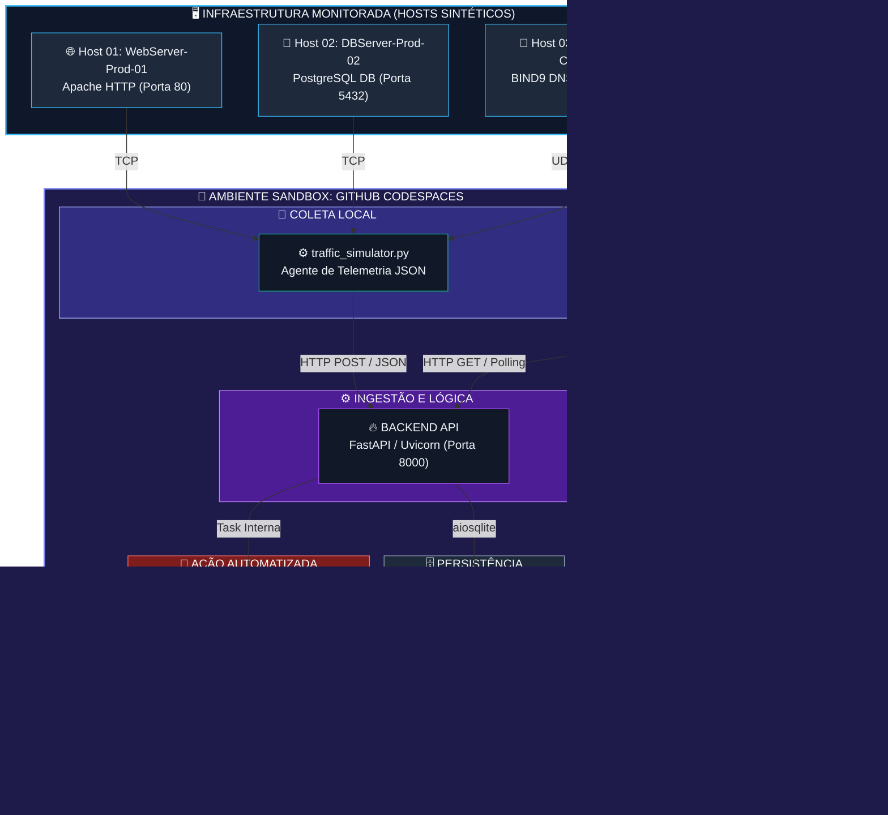

# Plataforma de Monitoramento DevOps — Documentação Técnica

## Sumário
* [1. Arquitetura do Sistema](#1-arquitetura-do-sistema)
* [2. Guia de Instalação — Runbook de Setup](#2-guia-de-instalação--runbook-de-setup)
* [3. Manual de Operação — Runbook do Operador](#3-manual-de-operação--runbook-do-operador)
* [4. Playbooks de Incidentes](#4-playbooks-de-incidentes)
* [5. Considerações de Segurança](#5-considerações-de-segurança)

---

## 1. Arquitetura do Sistema

### 1.1 Visão Geral
A plataforma é composta por camadas funcionais que se comunicam seguindo padrões arquiteturais de redes e o modelo REST (Representational State Transfer). Cada componente possui responsabilidade única e fronteiras bem definidas no ecossistema.

```text
┌─────────────────────────────────────────────────────────────────┐
│                        USUÁRIO / OPERADOR                        │
└───────────────────────────────┬─────────────────────────────────┘
                                │ HTTP (Browser)
                                ▼
┌─────────────────────────────────────────────────────────────────┐
│              FRONT-END  ·  localhost:3000                        │
│         Python HTTP Server · HTML/CSS/JS estático               │
│  Dashboard responsivo · Polling REST · Renderização de métricas │
└───────────────────────────────┬─────────────────────────────────┘
                                │ REST API (JSON)
                                │ GET /metrics  |  GET /alerts
                                ▼
┌─────────────────────────────────────────────────────────────────┐
│              BACK-END   ·  localhost:8000                        │
│          FastAPI + Uvicorn · Python 3.x · Async I/O             │
│   Ingestão de métricas · Validação · Lógica de negócio          │
│   Geração de alertas · Endpoints RESTful documentados (OpenAPI) │
└───────────────────────────────┬─────────────────────────────────┘
                                │ SQL (sqlite3)
                                ▼
┌─────────────────────────────────────────────────────────────────┐
│              BANCO DE DADOS  ·  ./metrics.db                     │
│                   SQLite 3 · Arquivo local                       │
│       Tabelas: metrics · alerts · security_events               │
└─────────────────────────────────────────────────────────────────┘
                                ▲
                                │ POST /ingest  (HTTP)
┌─────────────────────────────────────────────────────────────────┐
│          SIMULADOR DE TRÁFEGO  ·  traffic_simulator.py          │
│   Gera carga sintética · Publica métricas via REST no Backend   │
│   Simula picos, falhas HTTP 5xx, anomalias de latência e CVEs   │
└─────────────────────────────────────────────────────────────────┘
```

### 1.2 Mapeamento de Fluxo e Protocolos de Rede
O diagrama abaixo ilustra o ecossistema detalhado da aplicação, destacando o fluxo dos dados de telemetria desde a camada física/hosts até a ingestão assíncrona, a persistência local e o consumo na camada de aplicação pelo usuário.



### 1.3 Componentes e Responsabilidades

| Componente | Tecnologia | Porta | Responsabilidade |
| :--- | :--- | :--- | :--- |
| **Front-end** | Python HTTP Server / HTML+JS | 3000 | Exibição do dashboard; consulta REST periódica ao Backend |
| **Back-end** | FastAPI + Uvicorn | 8000 | API RESTful; ingestão, validação e persistência de métricas |
| **Banco de Dados** | SQLite 3 | — | Armazenamento persistente de métricas e eventos de segurança |
| **Simulador de Tráfego** | Python Script | — | Geração de carga sintética e dados de teste via HTTP POST |

### 1.4 Fluxo de Dados (Request Lifecycle)
1. **Simulador** → `POST /ingest` → **Backend** (valida e persiste via `aiosqlite`) → **SQLite**.
2. **Frontend** → `GET /metrics` → **Backend** (consulta tabelas locais) → **JSON** → **Render Dashboard**.

* O Frontend realiza polling a cada N segundos para os endpoints `/metrics` e `/alerts`.
* O Backend expõe documentação automática via OpenAPI (Swagger) em `http://localhost:8000/docs`.
* Toda comunicação entre as camadas utiliza JSON como formato exclusivo de serialização.

### 1.5 Padrões REST Adotados

| Princípio REST | Implementation |
| :--- | :--- |
| **Stateless** | Cada request ao Backend carrega toda informação necessária; sem sessão mantida no servidor |
| **Interface Uniforme** | Verbos HTTP semânticos: GET (leitura), POST (ingestão), DELETE (limpeza de histórico) |
| **Recursos Nomeados** | URIs limpas e descritivas: `/metrics`, `/alerts`, `/health`, `/ingest` |
| **Representação JSON** | Respostas estruturadas com cabeçalho `Content-Type: application/json` |
| **Códigos de Status HTTP** | Uso estrito de códigos nativos: 200 OK, 201 Created, 400 Bad Request, 422 Unprocessable Entity, 500 Internal Error |

---

## 2. Guia de Instalação — Runbook de Setup

### 2.1 Pré-requisitos
Antes de iniciar, certifique-se de que o ambiente atende aos seguintes requisitos mínimos:
* **Sistema Operacional:** Linux (Ubuntu 20.04+) ou ambiente controlado GitHub Codespaces
* **Python:** Versão 3.8 ou superior
* **pip:** Gerenciador de pacotes Python devidamente atualizado
* **Git:** Para versionamento e clonagem
* **Portas disponíveis na rede:** 3000 (Frontend) e 8000 (Backend)

Verificação rápida do ambiente via terminal:
```bash
python3 --version     # Esperado: Python 3.8+
pip --version         # Esperado: pip 21+
git --version
lsof -i :3000         # Deve retornar vazio (porta livre)
lsof -i :8000         # Deve retornar vazio (porta livre)
```

### 2.2 Instalação

**Passo 1 — Clonar o Repositório**
```bash
git clone https://github.com/seu-usuario/devops-monitoring-platform.git
cd devops-monitoring-platform
```

**Passo 2 — Criar e Ativar Ambiente Virtual (Recomendado)**
```bash
python3 -m venv .venv
source .venv/bin/activate
```

**Passo 3 — Instalar Dependências do Backend**
```bash
pip install --upgrade pip
pip install -r backend/requirements.txt
```

**Passo 4 — Configurar Variáveis de Ambiente**
```bash
cp backend/.env.example backend/.env
```
Edite o arquivo `backend/.env` recém-criado com as credenciais operacionais:
```env
# Configurações de SMTP para notificações de alertas emergências
SMTP_HOST=smtp.seu-provedor.com
SMTP_PORT=587
SMTP_USER=alertas@sua-empresa.com
SMTP_PASSWORD=sua_senha_segura

# Configurações do banco de dados local
DB_PATH=./metrics.db

# Nível de log operacional (DEBUG | INFO | WARNING | ERROR)
LOG_LEVEL=INFO
```
> ⚠️ **Aviso de Segurança:** NUNCA versione o arquivo `.env`. Certifique-se de que ele esteja listado corretamente dentro do arquivo `.gitignore`.

### 2.3 Inicialização dos Serviços
Execute cada comando em uma aba separada do terminal ou utilize um multiplexador de terminal (`tmux`):

* **Terminal 1: Inicialização do Backend (FastAPI + Uvicorn)**
  ```bash
  cd devops-monitoring-platform
  source .venv/bin/activate
  uvicorn backend.app:app --host 0.0.0.0 --port 8000 --reload --log-level info
  ```
  Verificação de integridade da API:
  ```bash
  curl -s http://localhost:8000/health | python3 -m json.tool
  # Esperado: {"status": "ok", "timestamp": "..."}
  ```

* **Terminal 2: Inicialização do Frontend (Python HTTP Server)**
  ```bash
  cd devops-monitoring-platform/frontend
  python3 -m http.server 3000
  ```
  Acesse a interface pelo navegador no endereço: `http://localhost:3000`

* **Terminal 3: Ativação do Simulador de Tráfego de Rede**
  ```bash
  cd devops-monitoring-platform
  source .venv/bin/activate
  python3 traffic_simulator.py
  ```

### 2.4 Checklist de Verificação Pós-Setup
* [ ] Backend responde em `http://localhost:8000/health` com status `200 OK`.
* [ ] Documentação automática Swagger/OpenAPI acessível em `http://localhost:8000/docs`.
* [ ] Frontend renderiza o Dashboard dinamicamente em `http://localhost:3000`.
* [ ] Arquivo local `metrics.db` gerado na raiz após o primeiro POST do simulador.
* [ ] Console do Uvicorn limpo de exceções críticas (`ERROR` ou `CRITICAL`).

---

## 3. Manual de Operação — Runbook do Operador

### 3.1 Interpretação dos Níveis de Alerta
O monitoramento utiliza um padrão visual baseado em semáforos para guiar as ações da equipe de operações:

| Nível | Cor | Significado Operacional | Ação Imediata |
| :---: | :--- | :--- | :--- |
| **Operacional** | 🟢 Verde | Todos os indicadores operando dentro dos limites normais estabelecidos. | Nenhuma. Apenas monitoramento de rotina e baselines. |
| **Degradado** | 🟡 Amarelo | Um ou mais indicadores atingiram a margem de alerta. Risco de queda de performance. | Investigar causa raiz via logs. Escalonar se persistir. |
| **Crítico** | 🔴 Vermelho | Limiares críticos violados. Alto risco ou confirmação de indisponibilidade em produção. | Acionar imediatamente o Playbook de Incidente correspondente. |

### 3.2 Métricas Monitoradas e Limiares de Alerta

#### 3.2.1 Latência de Resposta (ms)
* 🟢 **Normal:** `< 200 ms` — Tempo de resposta saudável para requisições síncronas.
* 🟡 **Alerta:** `200 ms – 500 ms` — Indicação de contenção em I/O, queries lentas ou consumo de CPU elevado.
* 🔴 **Crítico:** `> 500 ms` — Degradação severa da experiência. Verificar locks de tabela no SQLite.

#### 3.2.2 Requisições por Segundo (RPS)
* 🟢 **Normal:** Dentro da baseline histórica calculada de $\pm 20\%$.
* 🟡 **Alerta:** `+50%` acima do desvio padrão esperado da janela atual (pico repentino de tráfego).
* 🔴 **Crítico:** `+200%` (Indicativo de ataque de negação de serviço) ou queda abrupta para `0` (indisponibilidade).

#### 3.2.3 Códigos de Erro HTTP
* **4xx (Erros de Cliente):** Analisar malformação de dados vindos do simulador ou erros de rota.
* **5xx (Erros de Server):** Falha interna de código ou exceção não tratada na API.
* 🛑 **Limiar Crítico:** Taxa de erros HTTP 5xx acima de **5%** do volume total trafegado em uma janela de 1 minuto.

#### 3.2.4 Severidade de Vulnerabilidades (CVEs)
* 🟢 **Nenhuma:** Sem alertas de segurança ativos no inventário.
* 🟡 **Média (CVSS 4.0 – 6.9):** Planejar aplicação de patch corretivo na próxima janela homologada (até 72 horas).
* 🔴 **Alta/Crítica (CVSS 7.0 – 10.0):** Acionar o **Cenário C** do Playbook de Segurança imediatamente.

---

## 4. Playbooks de Incidentes

> **Padrão de Registro:** Identificar incidentes sob a nomenclatura `INC-YYYYMMDD-NNN`. Sempre abra o ticket correspondente antes de executar procedimentos invasivos em infraestrutura.

### Cenário A — Alerta Amarelo: Sobrecarga de Sistema
* **Gatilho:** Latência superior a 200ms E/OU RPS superior a 150% por mais de 3 minutos contínuos.
* **Objetivo:** Mitigar a saturação de recursos locais e reestabelecer as baselines de performance.

**Procedimento Operacional:**

1. **Reconhecimento Técnico:**
   ```bash
   echo "Abertura de Incidente: INC-$(date +%Y%m%d)-001 às $(date -u +%H:%M:%SZ)"
   ```
2. **Diagnóstico de Recursos de Hardware:**
   ```bash
   top -b -n 1 | grep python3          # Avalia consumo de CPU e RAM
   df -h .                             # Verifica se o disco atingiu 100% de ocupação
   ss -tnp | grep :8000 | wc -l         # Mede sockets abertos e conexões na porta da API
   ```
3. **Análise Forense de Logs:**
   ```bash
   journalctl -u uvicorn --since "10 minutes ago" | grep -E "(ERROR|WARNING|CRITICAL)"
   ```
4. **Análise de Sanidade do Banco de Dados:**
   ```bash
   sqlite3 metrics.db "PRAGMA integrity_check;"
   sqlite3 metrics.db "PRAGMA page_count; PRAGMA page_size;"
   ```
5. **Mitigação por Recarga (Hot-Reload):**
   ```bash
   kill -HUP $(pgrep -f uvicorn)       # Recarrega processos sem derrubar o socket principal
   ```

---

### Cenário B — Alerta Vermelho: Ataque de Negação de Serviço (DDoS)
* **Gatilho:** RPS acima de 300% da baseline e padrões de requisições repetitivas vindas de uma mesma origem ou rede.
* **Objetivo:** Isolar o tráfego ofensivo nas camadas mais baixas da rede e proteger o Backend.

**Procedimento de Mitigação Emergencial:**

1. **Identificação das Fontes Ofensivas:**
   ```bash
   # Filtra as conexões de rede mais pesadas diretamente conectadas à porta 8000
   ss -tn state established '( dport = :8000 )' | awk '{print $5}' | cut -d: -f1 | sort | uniq -c | sort -rn | head -10
   ```
2. **Bloqueio na Camada de Rede via Firewall (`iptables`):**
   ```bash
   # Substituir o IP abaixo pelo endereço atacante identificado no passo anterior
   sudo iptables -I INPUT -s 192.168.1.100 -j DROP
   
   # Salva o estado atual das regras do firewall local
   sudo iptables-save | sudo tee /etc/iptables/rules.v4
   ```
3. **Aplicação de Rate Limiting Preventivo via Sockets:**
   ```bash
   # Rejeita conexões que excedam 20 conexões simultâneas originadas do mesmo host
   sudo iptables -I INPUT -p tcp --dport 8000 -m connlimit --connlimit-above 20 -j REJECT --reject-with tcp-reset
   ```
4. **Coleta de Evidências (Dump de Pacotes):**
   ```bash
   sudo tcpdump -i eth0 port 8000 -w /tmp/DDoS_capture_$(date +%Y%m%d).pcap &
   ```

---

### Cenário C — Vulnerabilidade Crítica Detectada (CVE)
* **Gatilho:** Ingestão de alertas acusando score CVSS igual ou maior a 7.0 em algum ativo monitorado.
* **Objetivo:** Atualizar os pacotes de software mitigando a vulnerabilidade sem corromper as configurações de rede vigentes.

**Procedimento de Update Controlado:**

1. **Auditoria de Versão Corrente:**
   ```bash
   apache2 -v && psql --version && named -v
   ```
2. **Execução de Upgrade Cirúrgico (Targeted Update):**
   * *Para Servidores Web (Apache):*
     ```bash
     sudo apt-get update && sudo apt-get install --only-upgrade apache2
     sudo apache2ctl configtest && sudo systemctl reload apache2
     ```
   * *Para Servidores DNS (BIND9):*
     ```bash
     sudo apt-get update && sudo apt-get install --only-upgrade bind9
     sudo named-checkconf && sudo systemctl reload bind9
     ```
3. **Varredura de Validação de Redes:**
   ```bash
   # Executa script de auditoria de vulnerabilidades local para certificar o patch
   nmap --script vuln -p 80,53,5432 localhost
   ```

---

## 5. Considerações de Segurança

### 5.1 Gerenciamento Seguro de Segredos e Credenciais
Nenhuma credencial ou string de conexão é armazenada em formato *hardcoded* dentro dos arquivos do ecossistema. O Backend utiliza injeção dinâmica baseada no padrão de projeto Twelve-Factor App, lendo os segredos a partir do ambiente de execução através da biblioteca `python-dotenv`.

```python
from dotenv import load_dotenv
import os

load_dotenv()

# Inicialização segura de variáveis de ambiente de infraestrutura
SMTP_HOST     = os.getenv("SMTP_HOST")
SMTP_PORT     = int(os.getenv("SMTP_PORT", 587))
SMTP_USER     = os.getenv("SMTP_USER")
SMTP_PASSWORD = os.getenv("SMTP_PASSWORD")  # Jamais exposto em arquivos de log ou rotas públicas
```

### 5.2 Processamento Assíncrono Orientado a Eventos
Para garantir que a recepção de métricas de rede opere com latência mínima e resiliência contra ataques de esgotamento de threads, o motor core da API baseia-se em chamadas não-bloqueantes (`asyncio`):
* **Escrita Assíncrona em Banco:** O driver `aiosqlite` liberta o loop de eventos principal enquanto as operações de persistência em disco ocorrem, anulando contenções de leitura/escrita.
* **Segregação de Tarefas em Segundo Plano (BackgroundTasks):** O envio de notificações SMTP ou processamento pesado de logs é despachado para workers em background da própria API, permitindo que a resposta de ingestão (`201 Created`) seja retornada para o agente coletor imediatamente, de forma instantânea.

### 5.3 Matriz de Controles e Boas Práticas

| Prática de Segurança | Mecanismo de Implementação | Objetivo Prático |
| :--- | :--- | :--- |
| **Validação Estrita de Entrada** | Tipagem baseada em schemas nativos do `Pydantic` | Barra tentativas de injeção de código corrompido ou payloads malformados, retornando `422 Unprocessable Entity`. |
| **Controle de Origens (CORS)** | Configuração do `CORSMiddleware` restrito no FastAPI | Impede que scripts maliciosos injetados em navegadores de terceiros façam requisições administrativas na API. |
| **Mitigação de Vetores de Rede** | Banco de dados relacional baseado em arquivo local (`SQLite 3`) | Elimina completamente a abertura de portas de rede para banco (como a 3306 ou 5432), blindando o armazenamento contra ataques externos de rede. |
| **Auditoria Automatizada** | Varreduras via CLI com a ferramenta `pip-audit` | Identifica dependências vulneráveis dentro do ambiente Python antes da promoção do código para homologação. |

---
*Documentação técnica estruturada e homologada pela equipe de Engenharia de Plataforma e Infraestrutura.*